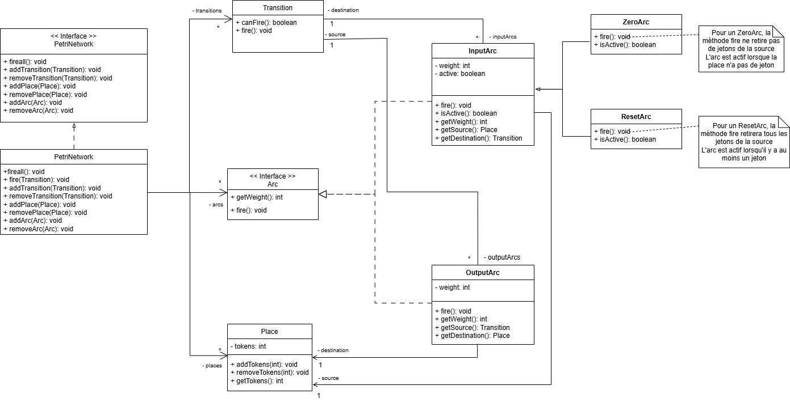

# Fil Rouge - PetriNet

This document explains, first of all, the contents of this project in relation to the models conceived to implement a Petri Network and then how to properly import and configure it in the Eclipse IDE.

## Overview

This project is a Java implementation of a Petri Network simulator. It provides a flexible framework for creating, managing, and simulating Petri Network. The architecture is built around core concepts like Places, Transitions, and Arcs, with support for extended Petri Network features such as Zero Arcs and Reset Arcs.

The design is based on object-oriented principles, using interfaces (IPetriNetwork, Arc) and abstract classes (AbstractArc) to ensure modularity and extensibility.

## PNEditor (Petri Net editor)

The original PNE can be downloaded from [www.pneditor.org](http://www.pneditor.org/)

This instance is the result of a student project by Joris Thaveau for teaching purpose.

It is a simplified Petri net editor that allows the editing of many PetriNet models.

To use:

1. Run org.pneditor.editor.Main as a Java application
2. Select the model used (the menu scans the org.pneditor.petrinet.adapters folder to build a list of available models and adapters). initial and imta are available. Places and transitions are displayed in different ways.
3. Edit the PetriNet and fire transitions.

You may experiment some unexpected exceptions. Especially if you mix models.

The pedagogical approach consists in:

1. Develop your own PetriNet model in an independent project/environment - with no GUI, just the ''business'' view
2. Pack it as a jar, and let it be visible in the path
3. Develop an Adapter in the org.pneditor.petrinet.adapters folder of PNE to make your model editable

The adapter may be simple or complex depending on the "distance" between your model and the one expected by PNE.

Code license: [GNU GPL v3](http://www.gnu.org/licenses/gpl.html)

Requirements: Java SE 8+

## Configuration / Running 

### 1. Prerequisites

* **Java JDK 17** (or newer) must be installed on your machine.
* **Eclipse IDE for Java Developers** (2022-XX release or newer).

---

### 2. How to Import

This project includes Eclipse configuration files (`.project` and `.classpath`). The easiest way to get started is to import it as an existing project.

1.  Open Eclipse.
2.  Go to `File` > `Open Projects from File System...`.
3.  In the import window, click `Directory` and navigate to this project's root folder (the one containing this `README.md`).
4.  The project (`fil-rouge`) should appear in the list. Ensure it is checked.
5.  Click `Finish`.

---

### 3. Configure the Workspace

If you see red errors on your code, especially on lines like `import org.junit.jupiter.api...` ("package does not exist"), it means the Java Build Path is incorrect.

Here is how to fix it manually:

#### A. Check Source Folders

1.  **Right-click** on the project in Eclipse's "Package Explorer".
2.  Go to the bottom of the menu and click **`Properties`**.
3.  In the new window, select **`Java Build Path`** from the left-hand menu.
4.  Click the **`Source`** tab at the top.
5.  Make sure this list contains your correct source folders:
    * `fil-rouge/src/main/java`
    * `fil-rouge/src/test/java`
6.  If they are missing, click `Add Folder...` to add them. If you see incorrect entries (like just `src`), select them and click `Remove`.

#### B. Add the JUnit Library 

1.  Stay in the same window (`Properties` > `Java Build Path`).
2.  Click the **`Libraries`** tab.
3.  Click on **`Classpath`** and select **`Add Library...`** from the right-hand menu.
4.  Select **`JUnit`**, click on `Next` and choose `JUnit 5`
5.  Click pn **`Finish`** and **`Apply and Close`**.

Eclipse will rebuild the project, and the errors on your JUnit imports should disappear.

---

### 4. Running Tests

Once the project is configured:
1.  Open the `src/test/java` folder.
2.  Navigate to a test file (e.g., `TestOutputArc.java`).
3.  **Right-click** on the file.
4.  Select `Run As` > `JUnit Test`.

Our PetriNetwork Model (sadokmelina)
======================

## Class Diagrams

## Core Components

The system is composed of the following key classes and interfaces:

### Network Management

- `IPetriNetwork` (Interface): Defines the public contract for a Petri Network. It includes methods for adding and removing places, transitions, and arcs.
- `PetriNetwork` (Class): The main class that implements IPetriNetwork. It holds collections of all Place, Transition, and Arc objects within the network. It provides the core simulation logic, such as the `fire(Transition)` method.

### Core Elements

- `Place` (Class): Represents a place in the Petri Network
    - `id`: A unique identifier
    - `tokens`: The number of tokens currently held in the place
    - Key Methods: `addTokens(int)`, `removeTokens(int)`
- `Transition` (Class): Represents a transition in the Petri Network, manages its connected input and output arcs
    - `id`: A unique identifier
    - Key Methods: `canFire()`, `fire()`, `addInputArc(Arc)`, `removeInputArc(Arc)`, `addOutputArc(Arc)`, `removeOutputArc(Arc)`,

### Arc Hierarchy

- `Arc` (Interface): The common interface for all arc types. Defines essential methods like `getWeight()`, and `isActive()`
- `AbstractArc` (Abstract Class): Provides a base implementation for `Arc`

### Concrete Arc Types

- `InputArc` (Class): A standard weighted arc that connects a `Place` (source) to a `Transition` (destination). Its `isActive()` method checks if the source place has enough tokens (>= weight). Its `fire()` method consumes tokens from the source place.
- `OutputArc` (Class): A standard weighted arc that connects a `Transition` (source) to a `Place` (destination). Its `fire()` method produces tokens in the destination place.

### Extended Arc Types

- `ZeroArc` (Class): A special type of `InputArc`
    - Its `isActive()` method returns true only if the source `Place` contains zero tokens
- `ResetArc` (Class): A special type of `InputArc`
    - Its `isActive()` method returns true if the place has at least one token
    - The `ResetArc`'s `fire()` method consumes all tokens from the source `Place`

## Conception vs Code 

1. Before integration : 

Our final implementation is, for the most part, very coherent with our modeling choices from the beginning except for the method fireall in the PetriNetwork Interface that was intended to fire all the transitions at once and that we had to delete because we found it unnecessary for the validation of the project and very ambiguious when it comes to its implementation logic (the order in which to fire the transitions). Furthermore, we decided to add the abstract class AArc that implements the interface Arc so that we can stock the ID count of all arcs regardless of their type (InputArc or OutputArc) in a commun attribute called nextID that is incremented by the AArc's constructor wether it's an input arc or an output arc that is initialised. This way no two arcs would have the same ID and presentation of the network to the user would be simpler.

Otherwise, we implemented the same classes specified in the diagram and gave them the same chosen behavior shown in the sequence diagrams with the network calling the canfire method of transitions to check their "fireability" and then calling fire() if needed. Also, these canfire() and fire() methods work as intended with canfire() using isActive() from InputArc which compares the weight of the arc and the number of tokens in all the places it's coming from and with fire() using fire() from InputArc to remove tokens from the source places according to the weight of each input arc and then fire() from OutputArc to add tokens to the destination places according to the weight of each output arc. 

2. After integration :

When integrating our model by implementing the adapters classes, and specifically the ArcAdapter, we realised that in order to implement the setMultiplicity method correctly we had to add our own setter for the weight of the arc class in our model.
